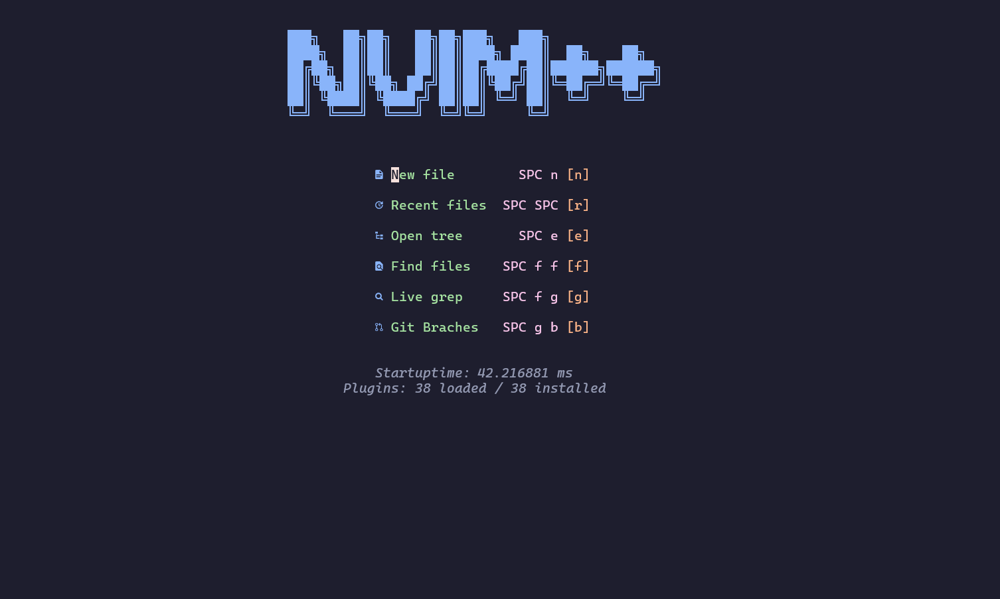

<p align="right">
  [🇩🇪 Deutsch](README.md) | 🇬🇧 **English**
</p>
# NeoVim C/C++ Development Setup

This repository contains an optimized NeoVim configuration for C/C++ development with powerful plugins for 
auto-completion, syntax highlighting, Git integration, and more. The setup is intentionally 
lightweight — fast to start, focused on essentials, and easy to customize to suit your needs.

Together with my other projects **[vhstack/tmuxpp](https://github.com/vhstack/tmuxpp)** and 
**[vhstack/termpp](https://github.com/vhstack/termpp)** , it forms a perfectly tuned working environment 
that provides seamless and efficient use of the Terminal, Tmux, and NeoVim.




## 🚀 Features

- **LSP support** for C/C++ with automatic completion
- **Syntax highlighting with** Treesitter
- **Git integration directly** in NeoVim
- **Advanced file navigation** with Telescope and NeoTree
- **Terminal integration** for smooth development workflows

## 📦 Installed Plugins

|Plugin | Description |
|--- | --- |
|`telescope` | Advanced fuzzy search and file navigation |
|`lsp` | Language Server Protocol (LSP) support for C/C++ |
|`mason` | Easy management of LSP servers, debuggers, and linters |
|`cmp` | Auto-completion engine for an improved coding workflow |
|`null-ls` | Support for formatting and static analysis (linters) |
|`lualine` | Customizable status line for NeoVim |
|`gitsigns` | Git integration with inline diff display |
|`treesitter` | Enhanced syntax highlighting for C/C++ |
|`toggleterm` | Integrated terminal within NeoVim |
|`outline` | Symbol outline view (e.g., classes, functions) |
|`autopairs` | Automatic pairing of brackets and quotes |
|`comments` | Easy commenting of code blocks |
|`buffline` | Enhanced buffer navigation |
|`blankline` | Visual representation of indent levels |
|`neotree` | File manager for improved navigation |
|`neogen` | Documentation generator within source code |
|`dashboard` | Start screen for NeoVim with quick access |
|`which-key` | Quick display of keybindings |
|`transparent` | Transparency mode for your color scheme |

## 🎨 Themes

**Installed color themes:**

- kanagawa
- onedark
- glowbeam
- catppuccin (catppuccin-latte, catppuccin-frappe, catppuccin-macchiato, catppuccin-mocha)

**Default Theme:**  
The Catppuccin color scheme with transparency enabled is set as the default.


**Option for light themes:**  
You can use `catppuccin-latte` (a light variant of Catppuccin) or install other themes that better suit your style.

## 📥 Installation

1. **Install NeoVim  
2. **Install the `rg` (Ripgrep) tool**  
3. **Install `clangd` for LSP** 
4. **Clone the repository & remove the Git directory:**

    ```sh
    git clone --depth 1 https://github.com/vhstack/nvimpp ~/.config/nvim
    rm -rf ~/.config/nvim/.git ~/.config/nvim/assets ~/.config/nvim/README*.md
    ```

5. **Sync plugins** with your plugin manager (`Packer`, `Lazy`, etc.)  
6. **Install LSPs & tools** via Mason by running `:Mason` in NeoVim

Optional: To install `clangd`, open NeoVim and run:
```vim
:MasonInstall clangd cmake-language-server
```

## 🖥️ Terminal Font

It is recommended to install a Nerd Font to ensure optimal display of symbols and glyphs in the terminal.

Nerd Fonts are available at [Nerd Fonts](https://www.nerdfonts.com/).

Great options include: Cascadia Code, FiraCode, DejaVu Sans Mono, and Cousine.

## 🛠 Custom Configuration

The `~/.config/nvim/lua/custom` directory comes with two sample scripts to help you add your own 
configuration tweaks without modifying the main setup:

- [_preload.lua](lua/custom/_preload.lua)
- [_postload.lua](lua/custom/_postload.lua)

To use the custom configuration, rename the template files:

```bash
mv ~/.config/nvim/lua/custom/_preload.lua ~/.config/nvim/lua/custom/preload.lua
mv ~/.config/nvim/lua/custom/_postload.lua ~/.config/nvim/lua/custom/postload.lua
```

By adjusting these files, you can add your own extensions like keybindings, plugins, or Lua code 
without altering the main configuration—your changes will remain intact during future updates.

### 📜 `lua/custom/preload.lua`

- **Loaded at NeoVim startup.**  
- Set global or environment variables or perform basic initializations here.  
- **Example**: Set LSP flags, load themes, adjust global options.

Available variables in `preload.lua`:

|Variable | Description | Default |
|---|---|--- |
|`vim.g.colorscheme` | Sets the NeoVim color scheme | `'catppuccin'` |
|`vim.g.is_transparency_enabled` | Enables/disables transparency | `true` |
|`vim.g.is_lsp_enabled` | Enables/disables LSP features | `true` |
|`vim.g.is_git_enabled` | Enables/disables Git features | `true` |

### 📜 `lua/custom/postload.lua`

- **Loaded after the main configuration.**  
- Ideal for **keymaps**, **UI tweaks**, and **fine-tuning** post-initialization.  
- **Example**: Keymap changes, color adjustments, status line tweaks.

## ⌨ Keybindings

This is an overview of the most important keybindings defined in this NeoVim configuration. 
The mappings are set up in Lua and cover a variety of features, from navigation to plugin-specific commands.

### Global Leader Key

|Shortcut | Description |
|---|--- |
|`<Space>` | Leader key |

### Function Keys

|Shortcut | Description |
|---|---|
|`<F5>` | Generate documentation with Neogen |
|`<F9>` | Run `make` |
|`<F10>` | Run `make clean` & `make -j3` |
|`<F12>` | Close buffer |

### Navigation

|Shortcut | Description |
|---|--- |
|`<C-k>` | Move window up |
|`<C-j>` | Move window down |
|`<C-h>` | Move window left |
|`<C-l>` | Move window right |
|`<C-w>` | Switch window |

### NeoTree

|Shortcut | Description |
|---|--- |
|`<leader>e`, `<C-e>` | Toggle NeoTree (sidebar) |
|`<leader>E` | Open NeoTree in float |
|`<leader>gs` | Show Git status in NeoTree |
|`<C-e>` | Toggle NeoTree sidebar |

### Telescope

|Shortcut | Description |
|---|--- |
|`<leader><leader>` | Recently opened files |
|`<leader>ff`, `<C-f>` | Find files |
|`<leader>fg`, `<C-g>` | Live grep search |
|`<leader>fb`, `<C-b>` | Open buffers |
|`<leader>fh` | Search help tags |

### Git (Telescope)

|Shortcut | Description |
|---|--- |
|`<leader>gb` | Git branches |
|`<leader>gc` | Git commits |
|`<leader>gd` | Git diffs |
|`<leader>gs` | Git status |

### Comments

|Shortcut | Description |
|---|--- |
|`<leader>/` | Toggle comment |

### Splits

|Shortcut | Description |
|---|--- |
|`|`   | Vertical split (`:vsplit`)  |
|`\` | Horizontal split (`:split`) |

### Tabs

|Shortcut | Description |
|---|--- |
|`<Tab>`, `<C-right>` | Next tab |
|`<S-Tab>`, `<C-left>` | Previous tab |
|`<C-S-right>` | Move tab right |
|`<C-S-left>` | Move tab left |

### Terminal

|Shortcut | Description |
|---|--- |
|`<leader>tt` | Floating terminal |
|`<leader>th` | Horizontal terminal |
|`<leader>tv` | Vertical terminal |

### LSP

|Shortcut | Description |
|---|--- |
|`<leader>lx`, `<C-x>` | Diagnostics with Telescope |
|`<leader>lX` | Diagnostics as float |
|`[d`,`ö` | Go to previous diagnostic |
|`]d`,`ä` | Go to next diagnostic |
|`<leader>la` | Code actions |
|`<leader>ld`, `<C-p>` | Go to definition |
|`<leader>lD`, `gD` | Go to declaration |
|`<leader>lk`, `<S-k>` | Hover documentation |
|`<leader>lr`, `gr` | Show references |
|`<leader>lt`, `gt` | Show type definition |
|`<leader>lR` | Rename |
|`<leader>lF` | Format |
|`<C-p>` | Go to definition |
|`<C-o>` | Go back |

### Misc

|Shortcut | Description |
|---|--- |
|`Y` | Yank entire line |
|`u` | Undo |
|`U` | Redo |
|`+` | Increment number |
|`-` | Decrement number |
|`<leader>n` | Toggle line numbers |
|`<leader>w` | Save file |
|`<leader>x` | Close buffer |
|`<leader>s` | Sort buffers by tabs |
|`<leader>h` | Highlight word or selection |
|`<leader>H` | Clear all highlights |
|`<leader>T` | Toggle transparency |
|`<leader>pl` | Open Lazy plugins |
|`<leader>pm` | Open Mason plugins |

## 🎯 Final Note

If you have ideas for new features or want to improve the project, feel free to fork and tailor 
it to your liking! Have fun and happy coding with nvimpp! 💻🚀
