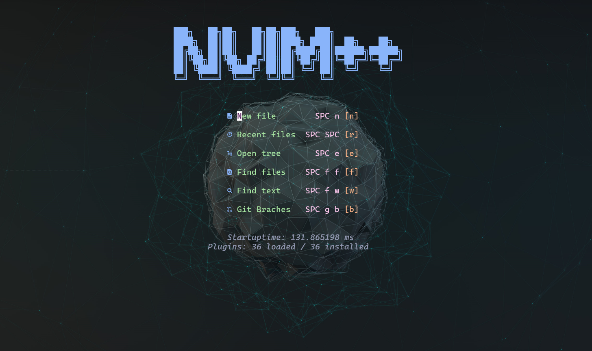

# NeoVim C/C++ Development Setup

Dieses Repository enthält eine optimierte **NeoVim**-Konfiguration für die **C/C++-Entwicklung** 
mit leistungsstarken Plugins für Autovervollständigung, Syntaxhervorhebung, Git-Integration und mehr.


## 🚀 Features
- **LSP-Unterstützung** für C/C++ mit automatischer Vervollständigung
- **Syntax-Highlighting** mit Treesitter
- **Git-Integration** direkt in NeoVim
- **Erweiterte Datei-Navigation** mit Telescope und NeoTree
- **Terminal-Integration** für reibungslose Entwicklungsabläufe

## 📦 Installierte Plugins

| Plugin | Beschreibung |
|--------|-------------|
| `telescope` | Erweiterte Fuzzy-Suche und Datei-Navigation |
| `lsp` | Language Server Protocol (LSP) für C/C++-Unterstützung |
| `mason` | Einfaches Management von LSP-Servern, Debuggern und Lintern |
| `cmp` | Auto-Completion-Engine für besseren Code-Workflow |
| `nullls` | Unterstützung für Formatierung und statische Analyse (Linter) |
| `lualine` | Anpassbare Statusleiste für NeoVim |
| `gitsigns` | Git-Integration mit Inline-Diff-Anzeige |
| `treesitter` | Verbesserte Syntaxhervorhebung für C/C++ |
| `toggleterm` | Integriertes Terminal in NeoVim |
| `outline` | Anzeige der Symbolstruktur (z. B. Klassen, Funktionen) |
| `autopairs` | Automatische Klammer- und Anführungszeichen-Paare |
| `comments` | Einfaches Kommentieren von Codeblöcken |
| `buffline` | Erweiterte Buffer-Navigation |
| `blankline` | Visuelle Darstellung von Einrückungen |
| `neotree` | Dateimanager für verbesserte Navigation |
| `neogen` | Dokumentation Generator in Sourcen |
| `dashboard` | Startbildschirm für NeoVim mit Schnellzugriff |
| `whichkey` | Schnelle Anzeige von Tastenkombinationen |
| `transparent` | Transparenz Modus für Farbschema |

## 🎨 Themen

**Installierte Farbthemen:**
- kanagawa
- onedark
- glowbeam
- catppuccin (catppuccin-latte, catppuccin-frappe, catppuccin-macchiato, catppuccin-mocha)

**Standard-Theme:**  
Das catppuccin-Farbschema und die Transparenz sind standardmäßig aktiviert. 

**Anpassungen:**  
Diese Einstellungen können bei Bedarf in der Datei `.config/nvim/init.lua` angepasst werden.
Farbschema: `vim.g.colorscheme`
Transparenz: `vim.g.is_transparency_enabled`

**Option für helle Themes:**  
Fans von hellen Themes können nutzen:
`catppuccin-latte` (Variante von catppuccin) oder weitere Themes installieren.

## 📥 Installation

1. **NeoVim installieren** 
2. **Tool `regrep` installieren**
3. **Für LSP `clangd` installieren**
4. **Repository klonen & Git-Verzeichnis entfernen:**
   ```sh
   git clone https://github.com/vhstack/nvimpp ~/.config/nvim
   rm -rf ~/.config/nvim/.git
   ```
5. **Plugins synchronisieren** mit dem Plugin-Manager (`Packer`, `Lazy`, etc.)
6. **LSPs & Tools installieren** über Mason (`:Mason` in NeoVim ausführen)

```sh
# Falls Mason installiert ist, öffne NeoVim und führe aus:
:MasonInstall clangd cmake-language-server
```

## 🖥️ Terminal Schriftart
Es wird empfohlen, eine Nerd Schriftart zu installieren, um eine optimale Darstellung von Symbolen und Glyphen im Terminal zu gewährleisten.

Nerd Schriftarten sind unter [Nerd Fonts](https://www.nerdfonts.com/) verfügbar. 

Gute Schriftarten fürs Coden sind: **Cascadia**, **FiraCode**, **DejaVuSansM**, **Cousine**


## 🛠 Konfiguration
### LSP Unterstützung
LSP Unterstützung kann in der Konfigurationsdatei `.config/nvim/init.lua` über die Variable `vim.g.is_lsp_enabled` aktiviert/deaktiviert werden.

## ⌨  Grundlegende Tastenkombinationen
Dies ist eine Übersicht der wichtigsten Tastenkombinationen, die in meiner NeoVim-Konfiguration definiert sind. 
Die Tasten sind als Lua-Key-Mappings konfiguriert und decken eine Vielzahl von Funktionen ab, von der Navigation bis hin zu spezifischen Plugins.
Diese Übersicht hilft dir, schnell die wichtigsten Befehle zu finden und zu nutzen.


### Globale Leader Taste

| Kürzel    | Bedeutung    |
| --------- | ------------ |
| `<Space>` | Leader Taste |

### F-Tasten

| Kürzel  | Bedeutung                           |
| ------- | ----------------------------------- |
| `<F5>`  | Neogen-Dokumentation generieren     |
| `<F9>`  | `make` ausführen                    |
| `<F10>` | `make clean` & `make -j3` ausführen |
| `<F12>` | Buffer schließen                    |

### Navigation

| Kürzel  | Bedeutung           |
| ------- | ------------------- |
| `<C-k>` | Fenster nach oben   |
| `<C-j>` | Fenster nach unten  |
| `<C-h>` | Fenster nach links  |
| `<C-l>` | Fenster nach rechts |
| `<C-w>` | Fenster wechseln    |

### NeoTree

| Kürzel       | Bedeutung                  |
| ------------ | -------------------------- |
| `<leader>E`  | NeoTree als Float anzeigen |
| `<leader>e`  | NeoTree links anzeigen     |
| `<leader>gs` | Git-Status in NeoTree      |
| `<C-e>`      | NeoTree links umschalten   |

### Telescope

| Kürzel             | Bedeutung                 |
| ------------------ | ------------------------- |
| `<leader><leader>` | Zuletzt geöffnete Dateien |
| `<leader>ff`       | Dateien suchen            |
| `<leader>fw`       | Live-Grep-Suche           |
| `<leader>fb`       | Geöffnete Buffer          |
| `<leader>fh`       | Hilfetags durchsuchen     |
| `<C-f>`            | Dateien suchen            |
| `<C-g>`            | Live-Grep-Suche           |
| `<C-t>`            | Buffer durchsuchen        |

### Git (Telescope)

| Kürzel       | Bedeutung    |
| ------------ | ------------ |
| `<leader>gb` | Git-Branches |
| `<leader>gc` | Git-Commits  |
| `<leader>gd` | Git-Status   |

### Kommentare

| Kürzel      | Bedeutung            |
| ----------- | -------------------- |
| `<leader>/` | Kommentar umschalten |

### Splits

| Kürzel | Bedeutung           |
| ------ | ------------------- |
| `|`    | Vertikales Split   |
| `\`    | Horizontales Split |

### Tabs

| Kürzel    | Bedeutung               |
| --------- | ----------------------- |
| `<Tab>`   | Nächsten Tab wechseln   |
| `<S-Tab>` | Vorherigen Tab wechseln |
| `<c-right>`   | Nächsten Tab wechseln   |
| `<c-left>` | Vorherigen Tab wechseln |
| `<c-s-right>`   | Tab nach rechts verschieben   |
| `<c-s-left>` | Tab nach links verschieben |

### Terminal

| Kürzel       | Bedeutung             |
| ------------ | --------------------- |
| `<leader>tt` | Terminal (Float)      |
| `<leader>th` | Terminal (Horizontal) |
| `<leader>tv` | Terminal (Vertikal)   |

### LSP

| Kürzel       | Bedeutung                |
| ------------ | ------------------------ |
| `<leader>lg` | Diagnostik in Quickfix   |
| `<leader>lG` | Diagnostik als Float     |
| `<c-d>`      | Diagnostik mit Telescope |
| `[d`         | Vorherige Diagnose       |
| `]d`         | Nächste Diagnose         |
| `<leader>ld` | Zur Definition springen  |
| `<leader>lD` | Zur Deklaration springen |
| `<leader>lK` | Hover-Dokumentation      |
| `<leader>lr` | Referenzen anzeigen      |
| `<leader>lt` | Typdefinition anzeigen   |
| `<leader>lR` | Umbenennen               |
| `<leader>lf` | Formatieren              |
| `K`          | Hover-Dokumentation      |
| `t`          | Zur Definition springen  |
| `T`          | Zur Deklaration springen |
| `<c-p>`      | Zur Deklaration springen |
| `<c-o>`      | Zurück springen          |

### Sonstige

| Kürzel       | Bedeutung                  |
| ------------ | -------------------------- |
| `<leader>n`  | Zeilennummern umschalten   |
| `Y`          | Ganze Zeile kopieren       |
| `<leader>w`  | Datei speichern            |
| `<leader>x`  | Buffer schließen           |
| `<leader>s`  | Buffer nach Tabs sortieren |
| `<leader>h`  | Wort oder Auswahl farblich markieren  |
| `<leader>H`  | Alle Markierungen zurücksetzen  |
| `<leader>T`  | Transparenz umschalten     |
| `<leader>pl` | Lazy Plugins öffnen        |
| `<leader>pm` | Mason Plugins öffnen       |


## 📜 Lizenz
Dieses Projekt steht unter der **MIT-Lizenz**.

---

Falls du weitere Funktionen hinzufügen möchtest, einfach anpassen! 🚀
