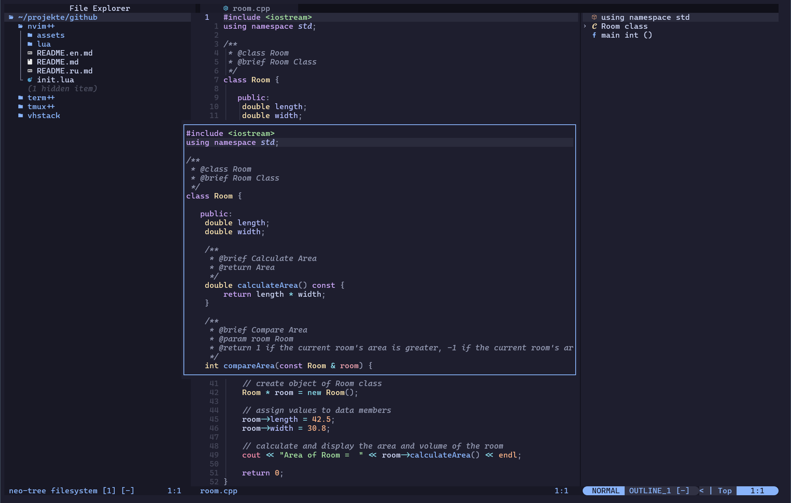

<p align="right">
  <a href="README.md"></a>  
  <a href="README.en.md"></a>  
  <a href="README.ru.md"></a>
</p>

# Neovim C/C++ Development Setup

Dieses Repository enthält eine optimierte **Neovim**-Konfiguration für die **C/C++-Entwicklung** 
mit leistungsstarken Plugins für Autovervollständigung, Syntaxhervorhebung, Git-Integration und mehr.
Das Setup ist bewusst schlank gehalten – schnell startklar, fokussiert auf das Wesentliche und lässt sich leicht an 
deine eigenen Bedürfnisse anpassen. 

Zusammen mit meinen anderen Projekten **[vhstack/tmuxpp](https://github.com/vhstack/tmuxpp)** und **[vhstack/termpp](https://github.com/vhstack/termpp)** 
bildet es eine perfekt abgestimmte Arbeitsumgebung, die dir eine nahtlose und effiziente Nutzung von Terminal, Tmux und Neovim ermöglicht.





## 🚀 Features
- **LSP-Unterstützung** für C/C++ mit automatischer Vervollständigung
- **Syntax-Highlighting** mit Treesitter
- **Git-Integration** direkt in Neovim
- **Erweiterte Datei-Navigation** mit Telescope und NeoTree
- **Terminal-Integration** für reibungslose Entwicklungsabläufe

## 📦 Installierte Plugins

| Plugin | Beschreibung |
|--------|-------------|
| `telescope` | Erweiterte Fuzzy-Suche und Datei-Navigation |
| `lsp` | Language Server Protocol (LSP) für C/C++-Unterstützung |
| `mason` | Einfaches Management von LSP-Servern, Debuggern und Lintern |
| `cmp` | Auto-Completion-Engine für besseren Code-Workflow |
| `nullls` | Unterstützung für Formatierung und statische Analyse (Linter) |
| `lualine` | Anpassbare Statusleiste für Neovim |
| `gitsigns` | Git-Integration mit Inline-Diff-Anzeige |
| `treesitter` | Verbesserte Syntaxhervorhebung für C/C++ |
| `toggleterm` | Integriertes Terminal in Neovim |
| `outline` | Anzeige der Symbolstruktur (z. B. Klassen, Funktionen) |
| `autopairs` | Automatische Klammer- und Anführungszeichen-Paare |
| `comments` | Einfaches Kommentieren von Codeblöcken |
| `buffline` | Erweiterte Buffer-Navigation |
| `blankline` | Visuelle Darstellung von Einrückungen |
| `neotree` | Dateimanager für verbesserte Navigation |
| `neogen` | Dokumentation Generator in Sourcen |
| `dashboard` | Startbildschirm für Neovim mit Schnellzugriff |
| `whichkey` | Schnelle Anzeige von Tastenkombinationen |
| `transparent` | Transparenz Modus für Farbschema |

## 🎨 Themen

**Installierte Farbthemen:**
- kanagawa
- onedark
- glowbeam
- catppuccin (catppuccin-latte, catppuccin-frappe, catppuccin-macchiato, catppuccin-mocha)

**Standard-Theme:**  
Das catppuccin-Farbschema und die Transparenz sind standardmäßig aktiviert. 

**Option für helle Themes:**  
Fans von hellen Themes können nutzen:
`catppuccin-latte` (Variante von catppuccin) oder weitere Themes installieren.

## 📥 Installation

1. **Neovim installieren** 
2. **Tool `rg` (Ripgrep) installieren**
3. **Für LSP `clangd` installieren**
4. **Repository klonen & Git-Verzeichnis entfernen:**
   ```sh
   git clone --depth 1 https://github.com/vhstack/nvimpp ~/.config/nvim
   rm -rf ~/.config/nvim/.git ~/.config/nvim/assets ~/.config/nvim/README*.md
   ```
5. **Plugins synchronisieren** mit dem Plugin-Manager (`Packer`, `Lazy`, etc.)
6. **LSPs & Tools installieren** über Mason (`:Mason` in Neovim ausführen)

```sh
# Optional: Um clangd zu installieren, öffne Neovim und führe folgenden Befehl aus:
:MasonInstall clangd cmake-language-server
```

## 🖥️ Terminal Schriftart
Es wird empfohlen, eine Nerd Schriftart zu installieren, um eine optimale Darstellung von Symbolen und Glyphen im Terminal zu gewährleisten.

Nerd Schriftarten sind unter [Nerd Fonts](https://www.nerdfonts.com/) verfügbar. 

Gute Schriftarten fürs Coden sind: **Cascadia**, **FiraCode**, **DejaVuSansM**, **Cousine**


## 🛠 Benutzerdefinierte Konfiguration
Das Verzeichnis `~/.config/nvim/lua/custom` wird mit zwei Beispielskripten ausgeliefert, die dir helfen, 
eigene Konfigurationsanpassungen vorzunehmen – ohne die Hauptkonfiguration zu verändern:

- [_preload.lua](lua/custom/_preload.lua)
- [_postload.lua](lua/custom/_postload.lua)

Wenn du die benutzerdefinierte Konfiguration verwenden willst, benenne die Vorlagendateien um:

```bash
mv ~/.config/nvim/lua/custom/_preload.lua ~/.config/nvim/custom/lua/preload.lua
mv ~/.config/nvim/lua/custom/_postload.lua ~/.config/nvim/lua/custom/postload.lua
```

Durch die Anpassung dieser Dateien kannst du eigene Erweiterungen wie Keybindings, Plugins oder Lua-Code ergänzen, 
ohne Änderungen an der Hauptkonfiguration vornehmen zu müssen – auch bei zukünftigen Aktualisierungen bleibt 
deine Konfiguration erhalten.

### 📜 `lua/custom/preload.lua`
- **Wird beim Starten von Neovim geladen.**
- Hier kannst du **globale Variablen** setzen, Umgebungsvariablen definieren oder grundlegende Initialisierungen vornehmen.
- **Beispiel**: LSP-Flag setzen, Themes laden, globale Optionen anpassen.

Folgende Variablen können im `preload.lua` angepasst werden:

| **Variable**                    | **Beschreibung**                                  | **Standardwert**           |
|----------------------------------|--------------------------------------------------|----------------------------|
| `vim.g.colorscheme`              | Setzt das Farbschema von Neovim                  | `'catppuccin'`             |
| `vim.g.is_transparency_enabled`  | Aktiviert/deaktiviert die Transparenz            | `true`                     |
| `vim.g.is_lsp_enabled`           | Aktiviert/deaktiviert LSP-Funktionen             | `true`                     |
| `vim.g.is_git_enabled`           | Aktiviert/deaktiviert Git-Funktionen.            | `true`                     |

### 📜 `lua/custom/postload.lua`
- **Wird nach dem Laden der Hauptkonfiguration geladen.**
- Ideal für **Keymaps**, **UI-Anpassungen** und **Feintuning** nach der initialen Konfiguration.
- **Beispiel**: Keymap-Änderungen, Farben, Statusline-Anpassungen.

## ⌨  Grundlegende Tastenkombinationen
Dies ist eine Übersicht der wichtigsten Tastenkombinationen, die in meiner Neovim-Konfiguration definiert sind. 
Die Tasten sind als Lua-Key-Mappings konfiguriert und decken eine Vielzahl von Funktionen ab, von der Navigation bis hin zu spezifischen Plugins.
Diese Übersicht hilft dir, schnell die wichtigsten Befehle zu finden und zu nutzen.


### Globale Leader Taste

| Kürzel    | Bedeutung    |
| --------- | ------------ |
| `<Space>` | Leader Taste |

### F-Tasten

| Kürzel  | Bedeutung                           |
| ------- | ----------------------------------- |
| `<F5>`  | Neogen-Dokumentation generieren     |
| `<F9>`  | `make` ausführen                    |
| `<F10>` | `make clean` & `make -j3` ausführen |
| `<F12>` | Buffer schließen                    |

### Navigation

| Kürzel  | Bedeutung           |
| ------- | ------------------- |
| `<C-k>` | Fenster nach oben   |
| `<C-j>` | Fenster nach unten  |
| `<C-h>` | Fenster nach links  |
| `<C-l>` | Fenster nach rechts |
| `<C-w>` | Fenster wechseln    |

### NeoTree

| Kürzel                | Bedeutung                     |
| --------------------- | ----------------------------- |
| `<leader>e`, `<C-e>`  | NeoTree links an-/ausschalten |
| `<leader>E`           | NeoTree als Float anzeigen    |
| `<leader>gs`          | Git-Status in NeoTree         |
| `<C-e>`               | NeoTree links umschalten      |

### Telescope

| Kürzel                     | Bedeutung                 |
| -------------------------- | ------------------------- |
| `<leader><leader>`         | Zuletzt geöffnete Dateien |
| `<leader>ff`, `<C-f>`      | Dateien suchen            |
| `<leader>fg`, `<C-g>`      | Live-Grep-Suche           |
| `<leader>fb`, `<C-b>`      | Geöffnete Buffer          |
| `<leader>fh`               | Hilfetags durchsuchen     |

### Git (Telescope)

| Kürzel       | Bedeutung    |
| ------------ | ------------ |
| `<leader>gb` | Git-Branches |
| `<leader>gc` | Git-Commits  |
| `<leader>gd` | Git-Diffs    |
| `<leader>gd` | Git-Status   |

### Kommentare

| Kürzel      | Bedeutung            |
| ----------- | -------------------- |
| `<leader>/` | Kommentar umschalten |

### Splits

| Kürzel | Bedeutung           |
| ------ | ------------------- |
| `|`    | Vertikales Split    |
| `\`    | Horizontales Split  |

### Tabs

| Kürzel                 | Bedeutung                   |
| ---------------------- | --------------------------- |
| `<Tab>`, `<C-right>`   | Nächsten Tab wechseln       |
| `<S-Tab>`, `<C-left>`  | Vorherigen Tab wechseln     |
| `<C-S-right>`          | Tab nach rechts verschieben |
| `<C-S-left>`           | Tab nach links verschieben  |

### Terminal

| Kürzel       | Bedeutung             |
| ------------ | --------------------- |
| `<leader>tt` | Terminal (Float)      |
| `<leader>th` | Terminal (Horizontal) |
| `<leader>tv` | Terminal (Vertikal)   |

### LSP

| Kürzel                | Bedeutung                |
| --------------------- | ------------------------ |
| `<leader>lx`, `<C-x>` | Diagnostik mit Telscope  |
| `<leader>lX`          | Diagnostik als Float     |
| `[d`                  | Zur vorherigen Diagnose  |
| `]d`                  | Zur nächsten Diagnose    |
| `ö`                   | Zur vorherigen Diagnose  |
| `ä`                   | Zur nächsten Diagnose    |
| `<leader>la`          | Code Aktionen            |
| `<leader>ld`, `<C-p>` | Zur Definition springen  |
| `<leader>lD`, `gD`    | Zur Deklaration springen |
| `<leader>lk`, `<S-k>` | Hover-Dokumentation      |
| `<leader>lr`, `gr`    | Referenzen anzeigen      |
| `<leader>lt`, `gt`    | Typdefinition anzeigen   |
| `<leader>lR`          | Umbenennen               |
| `<leader>lF`          | Formatieren              |
| `<C-p>`               | Zur Definition springen  |
| `<C-o>`               | Zurück springen          |

### Sonstige

| Kürzel       | Bedeutung                             |
| ------------ | ------------------------------------- |
| `Y`          | Ganze Zeile kopieren                  |
| `u`          | Rückgängig machen                     |
| `U`          | Wiederherstellen                      |
| `+`          | Zahl inkrementieren                   |
| `-`          | Zahl dekrementieren                   |
| `<leader>n`  | Zeilennummern umschalten              |
| `<leader>w`  | Datei speichern                       |
| `<leader>x`  | Buffer schließen                      |
| `<leader>s`  | Buffer nach Tabs sortieren            |
| `<leader>h`  | Wort oder Auswahl farblich markieren  |
| `<leader>H`  | Alle Markierungen zurücksetzen        |
| `<leader>T`  | Transparenz umschalten                |
| `<leader>pl` | Lazy Plugins öffnen                   |
| `<leader>pm` | Mason Plugins öffnen                  |


## 🎯 Schlusswort

Wenn du Ideen für neue Features hast oder das Projekt verbessern möchtest, 
dann fühl dich frei, es nach deinen Vorstellungen weiterzuentwickeln! 
Viel Spaß und viel Erfolg beim Programmieren mit nvimpp! 💻🚀
