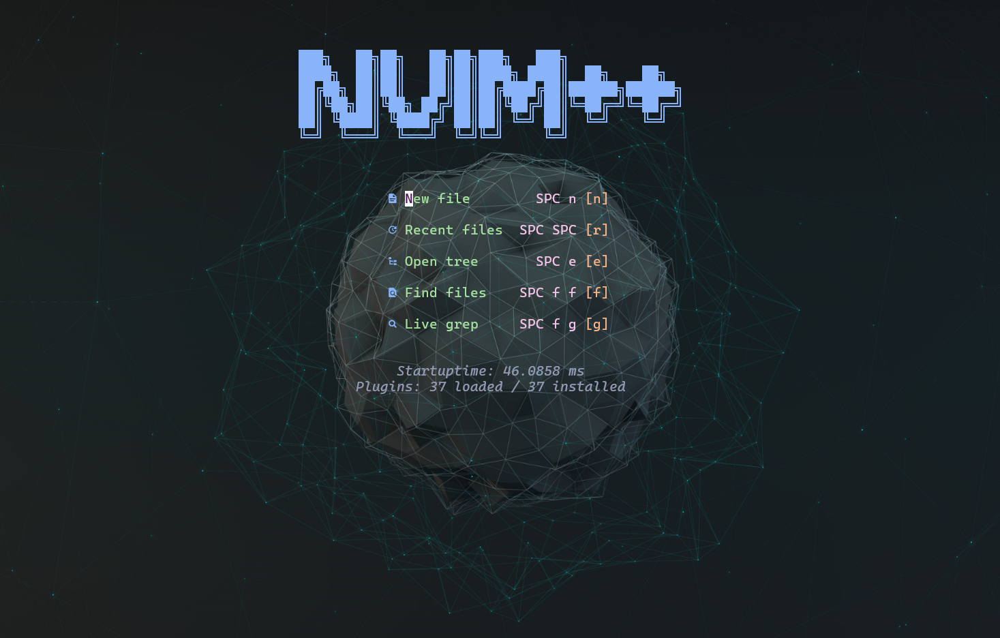
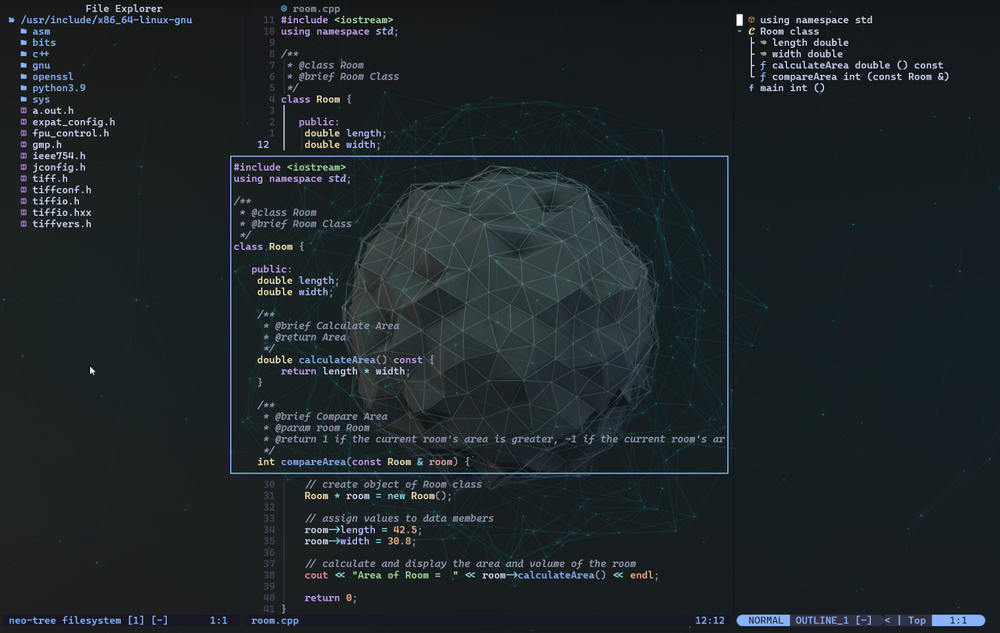
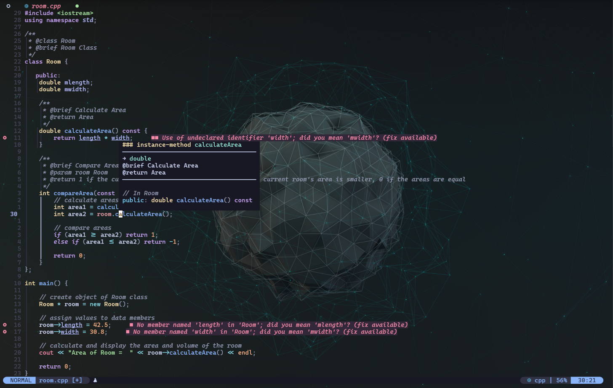

<p align="right">
  <a href="README.md"></a>  
  <a href="README.en.md"></a>  
  <a href="README.ru.md"></a>
</p>

# Настройка разработки на C/C++ в Neovim

В этом репозитории представлена оптимизированная конфигурация **Neovim** для разработки на **C/C++** с мощными плагинами для автодополнения, подсветки синтаксиса, интеграции с Git и многого другого. Конфигурация сознательно выдержана в минималистичном стиле — быстрое начало, фокус на главном и лёгкая адаптация под ваши нужды.

Вместе с моими другими проектами **[vhstack/tmuxpp](https://github.com/vhstack/tmuxpp)** и **[vhstack/termpp](https://github.com/vhstack/termpp)** это создаёт идеально согласованную рабочую среду для бесшовного и эффективного использования терминала, Tmux и Neovim.







## 🚀 Возможности
- **Поддержка LSP** для C/C++ с автоматическим автодополнением
- **Подсветка синтаксиса** с помощью Treesitter
- **Интеграция с Git** прямо в Neovim
- **Продвинутая навигация по файлам** с Telescope и NeoTree
- **Интеграция терминала** для беспрепятственного рабочего процесса

## 📦 Установленные плагины

| Плагин       | Описание                                                           |
|--------------|--------------------------------------------------------------------|
| `telescope`  | Расширенный fuzzy-поиск и навигация по файлам                      |
| `lsp`        | Language Server Protocol (LSP) для поддержки C/C++                 |
| `mason`      | Упрощённое управление LSP-серверами, отладчиками и линтерами       |
| `cmp`        | Движок автодополнения для улучшения рабочего процесса              |
| `conform`    | Поддержка форматирования кода                                      |
| `lualine`    | Настраиваемая строка состояния для Neovim                          |
| `gitsigns`   | Интеграция с Git с отображением diffs внутри редактора             |
| `treesitter` | Улучшенная подсветка синтаксиса для C/C++                          |
| `toggleterm` | Встроенный терминал в Neovim                                       |
| `outline`    | Отображение структуры символов (классы, функции и т.д.)            |
| `autopairs`  | Автоматическое закрытие скобок и кавычек                           |
| `comments`   | Простое комментирование блоков кода                                |
| `ansi`       | Отображение цветных ANSI-кодов                                     |
| `buffline`   | Расширенная навигация по буферам                                   |
| `blankline`  | Визуализация отступов                                              |
| `neotree`    | Файловый менеджер для улучшенной навигации                         |
| `neogen`     | Генератор документации в исходниках                                |
| `dashboard`  | Экран запуска Neovim с быстрым доступом                            |
| `whichkey`   | Быстрый просмотр горячих клавиш                                    |
| `transparent`| Режим прозрачности для цветовой схемы                              |

## 🎨 Темы

**Установленные цветовые схемы:**
- kanagawa
- onedark
- glowbeam
- catppuccin (catppuccin-latte, catppuccin-frappe, catppuccin-macchiato, catppuccin-mocha)

**Стандартная тема:**  
По умолчанию активирована цветовая схема catppuccin; прозрачность по умолчанию **отключена** (`vim.g.is_transparency_enabled = false`).

**Варианты светлых тем:**  
Любители светлых тем могут использовать:
`catppuccin-latte` или установить другие темы.

## 📥 Установка

1. **Установите Neovim**
2. **Установите утилиту `rg` (Ripgrep)**
3. **Установите для LSP сервер `clangd`**
4. **Клонируйте репозиторий и удалите папку .git:**
   ```sh
   git clone --depth 1 https://github.com/vhstack/nvimpp ~/.config/nvim
   rm -rf ~/.config/nvim/.git ~/.config/nvim/assets ~/.config/nvim/README*.md
   ```
5. **Синхронизируйте плагины** с помощью вашего менеджера плагинов (`Packer`, `Lazy` и т.д.)
6. **Установите LSP и утилиты** через Mason (выполните `:Mason` внутри Neovim)

```sh
# Опционально: чтобы установить clangd, откройте Neovim и выполните:
:MasonInstall clangd cmake-language-server
```

## 🖥️ Шрифт терминала
Рекомендуется установить Nerd-шрифт для оптимального отображения символов и глифов в терминале.

Nerd Fonts доступны на [nerdfonts.com](https://www.nerdfonts.com/).

Хорошие варианты для кодирования: **Cascadia**, **FiraCode**, **DejaVuSansM**, **Cousine**

## 🛠 Пользовательская конфигурация
Папка `~/.config/nvim/lua/custom` содержит два примера скриптов, которые помогут вам настроить собственную конфигурацию, не изменяя основную:

- `_preload.lua`
- `_postload.lua`

Чтобы начать использовать пользовательские настройки, переименуйте шаблонные файлы:

```bash
mv ~/.config/nvim/lua/custom/_preload.lua ~/.config/nvim/lua/custom/preload.lua
mv ~/.config/nvim/lua/custom/_postload.lua ~/.config/nvim/lua/custom/postload.lua
```

Это позволит добавлять собственные расширения (keybindings, плагины, Lua-код) без изменения главной конфигурации — ваши настройки не потеряются при обновлениях.

### 📜 `lua/custom/preload.lua`
- **Загружается при старте Neovim.**
- Здесь можно задавать **глобальные переменные**, устанавливать переменные окружения и выполнять базовую инициализацию.
- **Пример**: включение LSP, загрузка тем, настройка глобальных опций.

Следующие переменные можно изменить в `preload.lua`:

| **Переменная**                  | **Описание**                                  | **Значение по умолчанию** |
|----------------------------------|-----------------------------------------------|----------------------------|
| `vim.g.colorscheme`              | Задаёт цветовую схему Neovim                  | `'catppuccin'`             |
| `vim.g.is_transparency_enabled`  | Включает/выключает прозрачность               | `false`                    |
| `vim.g.is_lsp_enabled`           | Включает/выключает LSP                        | `true`                     |
| `vim.g.is_git_enabled`           | Включает/выключает Git-функции                | `true`                     |

### 📜 `lua/custom/postload.lua`
- **Загружается после основной конфигурации.**
- Идеально подходит для **Keymaps**, **UI-настроек** и тонкой настройки после загрузки.
- **Пример**: изменение сочетаний клавиш, цветов, статус-лайна.

## ⌨ Основные сочетания клавиш
Ниже приводится обзор основных сочетаний клавиш, определённых в моей конфигурации Neovim. Это поможет быстро освоить наиболее важные команды.

### Глобальная клавиша Leader

| Сочетание  | Назначение   |
|------------|--------------|
| `<Space>`  | Клавиша Leader |

### Функциональные клавиши

| Сочетание             | Назначение                           |
|---------------------- | -------------------------------------|
| `<F2>`                | Искать слово под курсором            |
| `<F5>`                | Генерация документации Neogen        |
| `<F8>`                | Переключение отображения цветов ANSI |
| `<F9>`,`<leader>m`    | Запуск `make`                        |
| `<F10>`               | `make clean` & `make -j3`            |
| `<F12>`               | Закрыть буфер                        |

### Навигация

| Сочетание | Назначение           |
|-----------|----------------------|
| `<C-k>`   | Окно вверх           |
| `<C-j>`   | Окно вниз            |
| `<C-h>`   | Окно влево           |
| `<C-l>`   | Окно вправо          |
| `<C-w>`   | Переключение окна    |

### NeoTree

| Сочетание               | Назначение                              |
|-------------------------|-----------------------------------------|
| `<leader>e`, `<C-e>`    | Включить/выключить NeoTree слева        |
| `<leader>E`             | Показать NeoTree в отдельном окне       |
| `<leader>gs`            | Git-статус в NeoTree                    |
| `<C-e>`                 | Переключить NeoTree слева               |

### Telescope

| Сочетание               | Назначение                     |
|-------------------------|--------------------------------|
| `<leader><leader>`      | Последние открытые файлы       |
| `<leader>ff`, `<C-f>`   | Поиск файлов                   |
| `<leader>fw`, `F2`      | Поиск слова под курсором       |
| `<leader>fg`, `<C-g>`   | Live-Grep поиск                |
| `<leader>fb`, `<C-b>`   | Открытые буферы                |
| `<leader>fh`            | Поиск по документации          |

### Git (Telescope)

| Сочетание    | Назначение       |
|--------------|------------------| 
| `<leader>gb` | Ветви Git              |
| `<leader>gc` | Коммиты Git            |
| `<leader>gd` | Git-статус (Telescope) |

### Комментарии

| Сочетание  | Назначение           |
|------------|----------------------|
| `<leader>/`| Переключить комментарий |

### Сплиты

| Сочетание | Назначение           |
|-----------|----------------------|
| `|`       | Вертикальный Split   |
| `\`       | Горизонтальный Split |

### Вкладки

| Сочетание               | Назначение                   |
|-------------------------|------------------------------|
| `<Tab>`, `<C-right>`    | Следующая вкладка            |
| `<S-Tab>`, `<C-left>`   | Предыдущая вкладка           |
| `<C-S-right>`           | Переместить вкладку вправо   |
| `<C-S-left>`            | Переместить вкладку влево    |

### Терминал

| Сочетание      | Назначение             |
|----------------|------------------------|
| `<leader>tt`   | Терминал (всплывающее) |
| `<leader>th`   | Терминал (горизонталь) |
| `<leader>tv`   | Терминал (вертикаль)   |

### LSP

| Сочетание               | Назначение                      |
|-------------------------|-------------------------------- |
| `<leader>lx`, `<C-x>`   | Диагностика через Telescope     |
| `<leader>lX`            | Диагностика во всплывающем окне |
| `[d`                    | Предыдущая диагностика          |
| `]d`                    | Следующая диагностика           |
| `ö`                     | Предыдущая диагностика          |
| `ä`                     | Следующая диагностика           |
| `<leader>la`            | Code Actions                    |
| `<leader>ld`, `<C-p>`   | Перейти к определению           |
| `<leader>lD`, `gD`      | Перейти к декларации            |
| `<leader>lk`, `<S-k>`   | Hover-документация              |
| `<leader>lr`, `gr`      | Показать ссылки                 |
| `<leader>lt`, `gt`      | Показать определение типа       |
| `<leader>lR`            | Переименовать                   |
| `<leader>lF`            | Форматировать                   |
| `<leader>lp`            | Сгенерировать `compile_commands`|
| `gd`                    | Перейти к определению           |
| `gi`                    | Перейти к реализации            |
| `gx`                    | Список диагностик               |
| `<C-t>`                 | Показать определение типа       |
| `<C-p>`                 | Перейти к определению           |
| `<C-o>`                 | Вернуться назад                 |

### Прочее

| Сочетание       | Назначение                            |
|-----------------|---------------------------------------|
| `Y`             | Скопировать всю строку                |
| `u`             | Отменить действие                     |
| `U`             | Восстановить                          |
| `+`             | Инкремент числа                       |
| `-`             | Декремент числа                       |
| `<leader>n`     | Переключить номера строк              |
| `<leader>w`     | Сохранить файл                        |
| `<leader>x`     | Закрыть буфер                         |
| `<leader>s`     | Сортировать буферы по вкладкам        |
| `<leader>h`     | Подсветить слово или выделение        |
| `<leader>H`     | Сбросить все подсветки                |
| `<leader>T`     | Переключить прозрачность              |
| `<leader>pl`    | Открыть Lazy Plugins                  |
| `<leader>pm`    | Открыть Mason Plugins                 |
| `<C-s>`         | Переключить структуру символов (Outline) |
| `g-`            | Переход между изменениями             |

## 🎯 Заключение

Если у вас есть идеи для новых функций или вы хотите улучшить проект, 
не стесняйтесь развивать его по своему усмотрению! 
Желаю приятного и успешного программирования с nvimpp! 💻🚀
